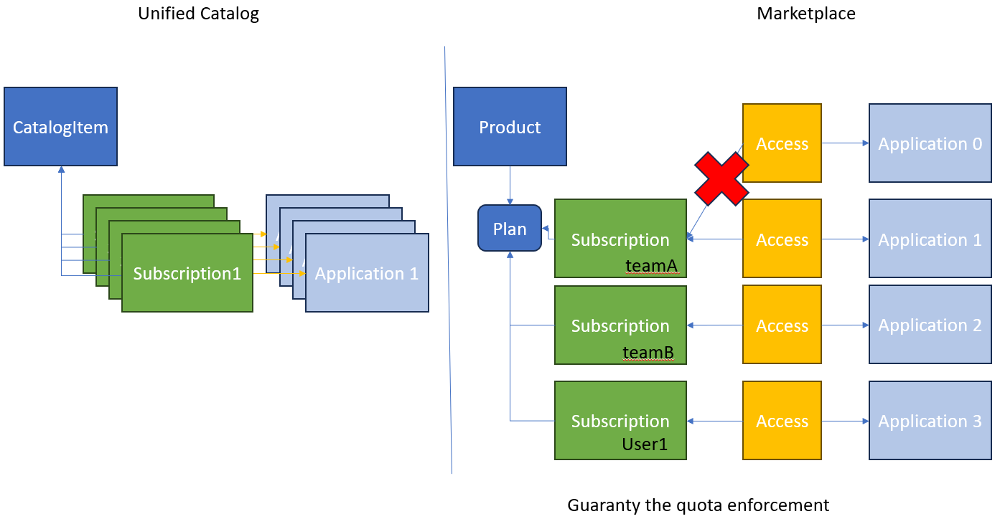

# Unified Catalog Migration

This document describes all the steps necessary to migrate your Unified Catalog items to the Amplify Enterpise Marketplace.
The migration from the Unified Catalog to the Enterprise Marketplace, consists of the following steps: 
1. Configure your Marketplace
2. Update your agents
3. Migrate your content

But before you start with the migration, we recommed you get yourself familiarized with the Amplify Enterpise Marketplacem. 
Please take a moment to watch our Enterpise Marketplace intro tutorial at https://university.axway.com/learn/courses/11665/introduction-to-amplify-enterprise-marketplace. You can also access our documentation at 
https://docs.axway.com/bundle/amplify-central/page/docs/index.html.

## Prerequisites

* [Axway CLI](https://docs.axway.com/bundle/amplify-central/page/docs/integrate_with_central/cli_central/index.html)
* [jq](https://jqlang.github.io/jq/)
* [curl](https://curl.se/)

## Configure your Marketplace
To configure your marketplace: 
   * Go to https://platform.axway.com/org/marketplace.
   * Click "+ Marketplace" button to add your first Marketplace.
   * Follow the steps described [here](https://docs.axway.com/bundle/amplify-central/page/docs/manage_marketplace/customize_marketplace/index.html) to set up your Marketplace.

Please note the public marketplace might not be enabled for you with your subscription.

## Update your agent
Before you move on to the next step, make sure you are running on the [latest agent version](https://docs.axway.com/bundle/amplify-central/page/docs/amplify_relnotes/index.html).
Please refer to [Upgrade an agent]( https://docs.axway.com/bundle/amplify-central/page/docs/connect_manage_environ/connected_agent_common_reference/upgrade_agent/index.html), for how to upgrade to the latest agent version.

You must stop the agent before proceeding to the next step.

## Migrate your content

To migrate your Unified Catalog items to the Enterpise Marketplace, you must run the migration script. The script will execute the following:
1. Logs onto the platform with `axway auth login`. To authenticate using the service account, you must explicitly set in the environment configuration file (please refer to Configuration step).
2. Reads all existing catalog items from a specific environment
3. For each catalog item
    * Looks for the linked API Service.
    * Creates a new asset (or use an existing one) and link the API Service to this asset.
    * Creates a new product (or use an existing one) and link the asset to this product.
    * (Optional) Publish the product to a selected Marketplace.
    * (Optional) Create a corresponding Marketplace subscription and application for each catalog item subscription
      * This applies only if the product is published in a Marketplace
      * Only active catalog item subscriptions are migrate to the Marketplace
    
The script can be run on Microsoft Windows bash shell or Linux.

### Configuration

An environment file is available in the config directory to set some properties:

* _CLIENT_ID_: configure the service account to connect to the Amplify Enterpise Marketplace. Please refer to [Manage service accounts](https://docs.axway.com/bundle/platform-management/page/docs/management_guide/organizations/managing_organizations/managing_service_accounts/index.html)
* _CLIENT_SECRET_ to set the service account private key.
* _CENTRAL_ENVIRONMENT_ the name of the environment the Unified Catalog items belog to
* _PLAN_TITLE_ to set the default plan title
* _PLAN_QUOTA_ to set the default plan quota
* _PLAN_APPROVAL_MODE_ to set the subscription approval to either automatic (default) or manual
* _PUBLISH_TO_MARKETPLACES_ to configure if products need to be published to Marketplace
* _MARKETPLACE_TITLE_ the name of the Marketplace where the product must be published
* _ASSET_NAME_FOLLOW_SERVICE_VERSION_ to set the asset name rule. Set to Y if you would like the asset name to include the API Service version.
   * When the same API Service name is detected in multiple environments, the script will create one asset per each major API Service version and 1 product. For that, you need to set _ASSET_NAME_FOLLOW_SERVICE_VERSION=Y_

Example:

* Env1: APIServiceName - v1.0.0
* Env2: APIServiceName - v1.0.1
* Env3: APIServiceName - v2.0.0

Using _ASSET_NAME_FOLLOW_SERVICE_VERSION=Y_, after migration 2 assets and 1 product will be created.

* Asset **APIServiceName V1** contains APIServiceName - v1.0.0 and APIServicName - v1.0.1
* Asset **APIServiceName V2** will contain APIServiceName - v2.0.0
* Product **APIServiceName** with contain the newly created assets: Asset APIServiceName1 V1 and Asset APIServiceName V2

Using _ASSET_NAME_FOLLOW_SERVICE_VERSION=N_, after migration only 1 asset and 1 product will be created
* Asset APIServiceName will contain  APIServiceName - v1.0.0 and APIServiceName - v1.0.1 and APIServiceName - v2.0.0
* Product APIServiceName will be linked to Asset APIServiceName

### Mapping Unified Catalog => Marketplace

The following table shows the mapping between Unified Catalog objects and Enterprise Marketplace objects:

| Initial Objects                      | Asset                | Product       | Marketplace subscription | Marketplace application |
|------------------------------------|------------------------|---------------|--------------------------|-------------------------|
| **Consumer instance**                |                      |               |                          |                         |
|  Id                                  |                      |               |                          |                         |
|  Name                                |                      |               |                          |                         |
|  Title                               | Title                | Title         |                          |                         |
|  Description                         | Description          | Description   |                          |                         |
|  API Service                         | APIService           |               |                          |                         |
|                                      |                      |               |                          |                         |
| **APIService**                       |                      |               |                          |                         |
|  Icon (not used)                     |                      |               |                          |                         |
|                                      |                      |               |                          |                         |
| **APIServiceInstance**               |                      |               |                          |                         |
|  CredentialRequestDefinition         |                      |               |                          |                         |
|  AccessRequestDefinition             |                      |               |                          |                         |
|                                      |                      |               |                          |                         |
| **CatalogItem (= consumerInstance)** |                      |               |                          |                         |
|  Image/base64                        | Icon                 | Icon          |                          |                         |
|  Category(ies)                       |                      | Category(ies) |                          |                         |
|                                      |                      |               |                          |                         |
| **CatalogItemDocumentation**         |                      |               |                          |                         |
|  Value                               |                      | Article       |                          |                         |
|                                      |                      |               |                          |                         |
| **Subscription**                     |                      |               |                          |                         |
|  Name                                |                      |               | Name                     |                         |
|  Application name (if available)     |                      |               |                          | Name                    |
|  OwningTeam                          |                      |               | OwningTeam               | OwningTeam              |

### Subscription migration
In the Unified Catalog, there is only one subscription allowed per application for a catalog item. 
In the Marketplace, this will translate to one subscription per product plan, allowing only one application to be registred for a single API resource inside the product, to guarantee that the plan quota can be enforced correctly on the dataplane.



The migration script will create only 1 subscription that can be used with each resource in the product. This subscription is then used to add access to the various applications.

**Limitation**:
On the Marketplace side, it is not possible to access the same product resource using a subscription plan having a quota restriction and multiple applications. This is to help providers correctly enforce the subscription plan quotas.

The migration script displays this message `/!\ Cannot add access to {UNIFED_CATAOLOGSUBSCRIPTION_APPLICATION_NAME} using subscription {MARKETPLACE_SUBSCRIPTION_NAME}: access already exist for another application` if multiple applications try to access the same resource using the same subscription.

You can overcome this by using the unlimited quota variable: `PLAN_QUOTA="unlimited"`

### Run the migration script
To migrate all catalog items that belong to a specific environment you must run the following command:

```bash
./migrateUnifiedCatalog.sh
```
To migrate a single catalog item that belong to a specific environment, you must run the following command:

```bash
./migrateUnifiedCatalog.sh "catalogItemTitle"
```
### Start the agents
After the migration script is run successfully, you must start the agents again.

## Known limitations

* Unified catalog item tags are not migrated to the product
* Catalog item sharing rights does not translate to the product visibility settings
* A product can be published in only one Marketplace
